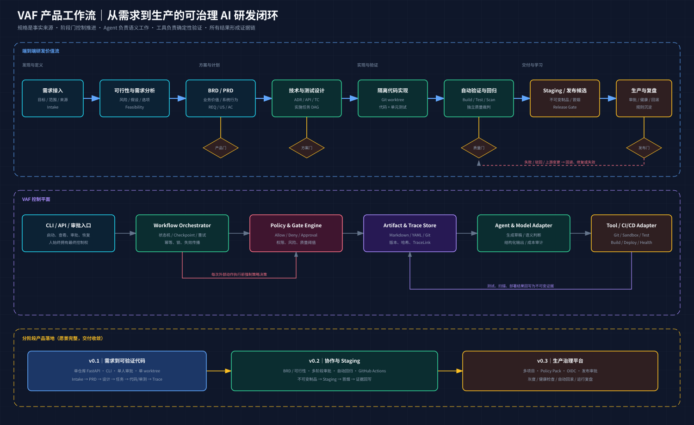

# VAF 产品需求文档（PRD）

> 文档状态：产品评审稿
>
> 本文定义 VAF 的产品目标、用户价值、功能边界和验收标准。技术实现细节以后续 Technical Design 为准。

## 1. 产品摘要

VAF 是一个面向软件项目的 AI 研发工作流控制平台。用户输入原始需求后，VAF 将研发过程组织为一组可执行、可审阅、可恢复、可追踪的阶段契约，逐步生成规格文档、实施代码、测试证据和发布记录。

VAF 的长期目标是实现从需求到生产部署的全流程自动化。M0 先采用确定性规则加评分门禁自动推进，不等待人工审批；生产权限、发布策略和高风险变更可在后续 Policy Pack 中单独配置。VAF 的核心价值是让每一个结论和外部动作都可验证、可追责、可回滚。

产品定位：

> 以规格为事实来源、以阶段门控制推进、以 Agent 执行语义任务、以确定性工具验证结果、以 CI/CD 完成交付的 AI 软件研发控制平面。



## 2. 背景与问题

### 2.1 用户现状

当前 Coding Agent 能快速生成代码，但真实企业研发需要的不只是代码，还包括业务目标、范围确认、技术决策、测试覆盖、发布审批和运行证据。依赖一次聊天完成这些工作会产生以下问题：

- 需求、设计和代码散落在会话中，难以版本化和复审。
- Agent 容易隐式补充需求、跳过关键阶段或扩大变更范围。
- 生成者同时自我验证，测试“通过”不能证明需求已被正确实现。
- 中断、失败或上游变更后缺乏可靠恢复机制，可能重复执行外部动作。
- 需求、代码、测试和部署之间没有完整证据链。
- 生产凭据、命令权限和发布授权容易被 Prompt 规则替代，缺少系统级强制门禁。

### 2.2 已有参考流程的启发与局限

现有 `ai-agent-workflow.md` 通过五步强制流程约束代码迁移，体现了“完整调用链、人工确认、错误分析和规范沉淀”的正确方向。但该流程面向特定 Java/DDD 迁移场景，尚未抽象出通用产物、状态、追踪、测试、部署和恢复机制。

VAF 将其升级为通用控制平面：特定 Java/DDD 迁移规则未来作为 Policy Pack 接入，不写死在核心工作流中。

## 3. 产品目标与非目标

### 3.1 长期目标

- 将原始需求稳定转换为可评审的 BRD、PRD、技术方案、测试用例和实施计划。
- 在隔离工作区内生成生产级候选代码和自动化测试。
- 自动完成构建、静态检查、测试、安全扫描、回归和追踪校验。
- 通过阶段门和评分门禁将合格制品交付到 staging；production 权限由后续发布策略控制。
- 支持失败恢复、变更失效传播、发布健康检查、回滚和规则沉淀。
- 让任何一个需求都能追踪到设计、任务、代码、测试证据和发布版本。

### 3.2 v0.1 产品目标

在一个单一 Python/FastAPI 示例仓库内，完成一条小型需求到可验证代码的闭环：

```text
Intake → PRD → 技术方案 → 实施任务 → 代码/单测 → 自动验证 → 追踪报告
```

v0.1 必须证明三件事：

1. 流程在评分门通过、驳回、失败和进程中断后可以正确恢复。
2. 未授权工具动作会被系统策略拦截，而不是依赖 Agent 自律。
3. 每条验收条件和每个代码变更都有可查询的实现与验证证据。

### 3.3 v0.1 非目标

- 提供本地单机 Web UI 和 CLI；不提供多租户 Web 平台能力。
- 不支持多项目、多租户和团队级权限体系。
- 不自动部署 staging 或 production。
- 不自动创建 PR、合并分支或修改用户当前工作区。
- 不支持 Java、Node.js 等多语言适配。
- 不实现完整 BRD、可行性分析和自动回归选择；这些进入 v0.2。
- 不以多 Agent 数量作为能力指标；第一版只区分生成和验证职责。

## 4. 目标用户与角色

| 角色 | 核心诉求 | 在 VAF 中的职责 |
|---|---|---|
| 需求发起人 | 把模糊想法变成可执行需求 | 提交需求、确认目标和非目标 |
| 产品负责人 | 控制产品范围与验收口径 | 审阅 PRD、验收条件和变更请求 |
| 技术负责人 | 控制架构风险与实现边界 | 审阅技术方案、风险和实施任务 |
| 开发者 | 获得可信的候选实现 | 配置仓库规则、评审 diff、处理阻塞 |
| 测试/质量负责人 | 确认需求真正被验证 | 审阅测试覆盖和验证证据 |
| 发布负责人 | 安全、可控地交付制品 | 在后续版本审批 staging/production |
| VAF 管理者 | 维护平台规则和适配器 | 管理 Profile、Policy Pack、模型和工具权限 |

v0.1 面向单人使用，但需要在数据模型中保留 `actor`、`reviewer` 和 `approval`，避免以后无法演进为团队协作。

## 5. 核心概念

| 概念 | 定义 |
|---|---|
| Project | 接入 VAF 的代码仓库及其规则集合 |
| Change | 一次有明确目标和边界的研发变更 |
| WorkflowRun | 某个 Change 的一次工作流执行 |
| StageRun | 一个阶段的一次执行尝试 |
| ArtifactVersion | 不可变的规格或报告版本 |
| Gate | 决定阶段是否可以推进的机器规则、评分和证据集合 |
| PolicyDecision | 针对一次工具动作或流程推进的允许、拒绝或需审批结论 |
| ToolInvocation | 一次可审计、可幂等恢复的外部工具调用 |
| TraceLink | 需求、设计、任务、代码、测试与证据之间的不可变关系 |
| Evidence | 测试、扫描、diff、审批或部署结果的可验证记录 |
| Profile | 按变更风险选用的流程和门禁组合 |
| Policy Pack | 某类项目或场景的可插拔约束，如 Java DDD 迁移规则 |

## 6. 产品原则

1. 规格优先，但允许有记录地回退和演进，不做僵化文档瀑布。
2. Agent 只能生成候选结果，不能自行宣布阶段通过。
3. 机器负责可确定验证、评分和阶段推进；生产授权属于后续可配置策略。
4. 生成与验证职责分离，验证不能只引用生成 Agent 的自评。
5. 每次外部动作都先经过 Policy Engine，再由工具适配器执行。
6. 已审批产物不可原地覆盖；上游新版本会使下游结果失效。
7. Git 保存规格和审批事实；大日志只保存引用、摘要和哈希。
8. 自动部署不等于无人审批，production 默认必须人工授权。

## 7. 用户主流程

### 7.1 v0.1 主流程

1. 用户在目标仓库执行 `vaf init`，生成 `.vaf/` 目录、项目规则和默认工作流。
2. 用户以文本或 Markdown 创建一个 Change，并执行 `vaf run --change <id>`。
3. VAF 校验 Intake，生成 PRD 草稿，并输出假设、缺口和待确认项。
4. VAF 通过 `review` 输出评分和证据；`autopilot` 在分数严格大于 90 且无 P0 阻塞时自动推进，否则回到当前阶段重试。
5. PRD 门通过后，VAF 依次生成技术方案、测试用例和实施任务，不等待人工审批。
6. VAF 创建隔离 worktree，在允许路径内生成代码和单元测试。
7. VAF 通过策略网关执行白名单构建、Lint 和 pytest 命令。
8. 验证通过后，VAF 生成 Trace Report 和变更摘要；质量门通过后生成可交付候选，不自动合并生产分支。
9. 用户自行决定是否把候选变更提交、创建 PR 或继续修改；v0.1 不自动合并。

### 7.2 异常与回退流程

- 产物 Schema 不通过：阶段停留在 `RUNNING`，自动修复次数耗尽后进入 `FAILED`。
- 人工要求修改：阶段进入 `CHANGES_REQUESTED`，保留旧版本并产生新版本。
- 输入缺失且不能安全假设：进入 `BLOCKED`，显示具体阻塞项和恢复条件。
- 进程中断：重新执行 `resume` 时从最后事件恢复，不重复已完成的幂等动作。
- 上游已审批产物变化：所有引用旧哈希的下游阶段进入 `INVALIDATED`。
- 工具动作越权：策略返回 `DENY`，不执行工具，并生成脱敏审计记录。
- 验证失败：输出失败分类、证据和建议修复入口，不以自然语言“看起来正确”替代测试。

## 8. 功能需求

优先级定义：P0 为 v0.1 必须具备；P1 为 v0.2；P2 为 v0.3 或更后。

### 8.1 项目初始化与配置

#### FR-001 初始化 VAF 项目（P0）

系统应支持在目标 Git 仓库执行 `vaf init`，生成 `.vaf/manifest.yaml`、`constitution.md`、默认工作流、产物目录和追踪目录。

验收条件：

- AC-001：非 Git 仓库中执行时给出明确错误，不产生半成品目录。
- AC-002：重复执行默认不覆盖用户已修改配置，并展示差异或冲突。
- AC-003：初始化结果通过 Schema 校验。
- AC-004：配置明确声明允许写入路径和允许执行的验证命令。

#### FR-002 项目规则（P0）

系统应读取仓库内的 `AGENTS.md`、`CLAUDE.md` 和 VAF Constitution，并形成带来源的有效规则集。

验收条件：

- AC-005：规则来源、优先级和冲突可查看。
- AC-006：规则不能授予超过系统策略上限的权限。

### 8.2 Change 与工作流运行

#### FR-003 创建并运行 Change（P0）

系统应为每次变更分配稳定 `change_id`，保留原始需求、来源、目标、非目标、风险标记和创建者。

验收条件：

- AC-007：缺少目标、范围或来源时不能进入文档生成阶段。
- AC-008：同一 Change 同时只能有一个会修改工作区的活动 Run。
- AC-009：每次运行具有独立 `run_id`，历史运行可查询且不可静默覆盖。

#### FR-004 可恢复阶段状态机（P0）

系统应支持以下阶段状态及受控转换：

```text
PENDING → RUNNING → WAITING_REVIEW → APPROVED
RUNNING → BLOCKED | FAILED | CANCELLED
WAITING_REVIEW → CHANGES_REQUESTED | REJECTED | EXPIRED
CHANGES_REQUESTED → RUNNING
FAILED → RETRYING → RUNNING | ABORTED
APPROVED → INVALIDATED
```

验收条件：

- AC-010：非法状态转换被拒绝并记录原因。
- AC-011：审批重复提交不导致阶段重复推进。
- AC-012：模拟进程中断后可从最后事件恢复。
- AC-013：恢复后不会重复执行同一幂等工具调用。
- AC-014：上游产物哈希变化会失效所有依赖旧版本的下游阶段。

### 8.3 规格产物与自动门禁

#### FR-005 结构化产物（P0）

系统应生成带 YAML frontmatter 的 Markdown 产物，并使用 Schema 校验元数据、正文必需章节和对象引用。

v0.1 产物包括：

- `00-intake.md`
- `01-prd.md`
- `02-technical-design.md`
- `03-test-cases.md`
- `04-implementation-plan.md`
- `05-verification-report.md`
- `06-trace-report.md`

验收条件：

- AC-015：每个产物具有 artifact ID、类型、版本、状态、依赖、输入哈希和创建信息。
- AC-016：已审批版本不可原地修改，修改会创建新版本。
- AC-017：存在悬空 REQ、AC、TASK 或 TC 引用时阶段门不能通过。
- AC-018：模型原始输出不直接成为已审批产物，必须经过解析和 Schema 校验。

#### FR-006 PRD 生成与质量检查（P0）

系统应把 Intake 转换为包含用户场景、需求 ID、验收条件、边界、异常、非功能需求、假设和非目标的 PRD 草稿。

验收条件：

- AC-019：每条系统行为具有稳定 `REQ-*` 和至少一个 `AC-*`。
- AC-020：未确认的业务信息只能进入“假设/待确认项”，不能伪装成确定需求。
- AC-021：PRD 明确区分目标、非目标和后续范围。
- AC-022：验收条件必须可观察、可验证，不能只写“体验良好”等主观表述。

#### FR-007 自动评分门禁与驳回（P0）

系统应在每个阶段执行结构化评审和确定性评分。只有分数严格大于 90 且不存在 P0 阻塞项时，才能自动推进；否则进入 `CHANGES_REQUESTED` 或 `BLOCKED`，回到当前阶段循环。`approve`、`reject` 保留为兼容旧运行记录的诊断接口，不是 M0 的默认路径。

验收条件：

- AC-023：门禁记录包含 gate 类型、各评分维度、分数、规则证据、目标产物哈希和决定。
- AC-024：对旧版本提交门禁决定不会批准新版本。
- AC-025：门禁驳回后，原评分记录与旧产物仍可审计，并创建新的阶段尝试。

### 8.4 技术设计、任务与测试

#### FR-008 技术方案（P0）

系统应基于批准的 PRD 和仓库上下文生成技术方案，至少覆盖变更范围、组件影响、接口/数据、错误处理、安全、测试、兼容性和风险。

验收条件：

- AC-026：每个关键技术决策具有 ADR 或明确理由。
- AC-027：方案中的组件、文件或命令引用能够在仓库中解析，未知项被明确标注。
- AC-028：方案不得突破 Constitution 和 Policy Engine 的权限边界。

#### FR-009 测试用例（P0）

系统应为每条验收条件生成正向、反向和边界测试候选，并建立 AC 到 TC 的关系。

验收条件：

- AC-029：所有已批准 AC 至少关联一个 TC，否则质量门失败。
- AC-030：每个 TC 包含前置条件、输入、步骤、预期结果和优先级。
- AC-031：验证 Agent 能指出无有效断言、只测实现细节或遗漏异常路径的用例。

#### FR-010 实施计划（P0）

系统应把技术方案拆分为有依赖关系、可独立验证、可追踪的任务。

验收条件：

- AC-032：每个 TASK 至少关联一个 REQ/AC。
- AC-033：任务具有允许变更范围和完成条件。
- AC-034：任务依赖图不存在环。

### 8.5 隔离实现与工具策略

#### FR-011 隔离代码实现（P0）

系统应在单独 Git worktree 中生成候选代码和测试，不修改用户当前工作树。

验收条件：

- AC-035：创建 worktree 前检查 Git 状态、路径冲突和锁。
- AC-036：只允许修改任务声明和策略允许的路径。
- AC-037：检测到未授权文件变化时立即阻断后续工具执行。
- AC-038：失败退出时保留可诊断信息，并提供可控清理方式，不自动删除用户内容。

#### FR-012 强制策略网关（P0）

所有工具调用必须经过 `ToolInvocation → PolicyDecision → Allow / Deny / RequireApproval`。

验收条件：

- AC-039：非白名单命令被拒绝且工具进程未启动。
- AC-040：工作区外写入被拒绝。
- AC-041：默认禁止网络访问；例外必须有明确策略和审计记录。
- AC-042：Secret 只以引用传递，明文不得进入模型上下文、产物和日志。
- AC-043：Agent 永远不持有 production 部署权限。

#### FR-013 幂等工具调用（P0）

系统应为有副作用的工具调用生成稳定幂等键，记录“意图、执行、结果”三个阶段。

验收条件：

- AC-044：相同幂等键的已完成动作在恢复时返回已有结果。
- AC-045：状态不明的动作先查询外部状态，不盲目重跑。
- AC-046：每次调用关联 run、stage、attempt、policy decision 和脱敏输出。

### 8.6 验证、追踪与报告

#### FR-014 自动验证（P0）

系统应执行仓库声明的格式化检查、Lint、构建和 pytest，并生成结构化验证报告。

验收条件：

- AC-047：退出码、命令、耗时、日志摘要和证据哈希被记录。
- AC-048：任一必需验证失败时质量门不得通过。
- AC-049：生成 Agent 不能修改或解释掉真实工具退出码。
- AC-050：验证阶段使用独立验证逻辑，不把开发 Agent 自评作为通过依据。

#### FR-015 需求追踪（P0）

系统应使用不可变 TraceLink 表达 `REQ/AC → ADR/API → TASK → CODE_DIFF → TC → EV`。

验收条件：

- AC-051：AC 覆盖率定义为“已批准 AC 中至少关联一个通过 TC 的比例”。
- AC-052：变更可解释率定义为“非格式化代码文件中关联至少一个 TASK 与 REQ/AC 的比例”。
- AC-053：v0.1 的两个指标均须达到 100%，否则最终质量门失败。
- AC-054：TraceLink 的对象不存在或版本失效时报告明确断链位置。

#### FR-016 运行状态与审计报告（P0）

系统应提供 `status`、`review`、`verify` 和 `trace` 命令，使用户能够理解当前阶段、阻塞原因、成本和证据。

验收条件：

- AC-055：状态输出区分待运行、运行中、待审批、失败、阻塞和失效。
- AC-056：每次 Run 输出阶段耗时、模型调用次数/成本、工具耗时、重试次数和失败分类。
- AC-057：日志对令牌、密钥、Cookie、Authorization Header 和常见个人信息做脱敏。

### 8.7 后续版本能力

#### FR-017 企业完整文档链（P1）

增加可行性分析、需求分析和 BRD；明确三者分别负责技术/成本可行性、歧义与假设、业务价值与指标，避免重复生成同一内容。

#### FR-018 Profile 与风险自动升级（P1）

支持 Lite、Standard、Enterprise。纯文档或测试变更可使用 Lite；新接口、数据模型和外部 API 至少 Standard；数据迁移、鉴权、支付、生产配置和个人数据至少 Enterprise，用户只能主动提高不能降低系统判定的最低 Profile。

#### FR-019 回归选择（P1）

根据变更影响和历史基线选择回归用例，并解释每个用例入选或未入选原因。

#### FR-020 Staging 发布（P1）

通过 CI/CD Adapter 构建不可变制品，自动部署 staging，执行冒烟和回归，并将回调结果幂等写入 Evidence。

#### FR-021 生产发布治理（P2）

支持环境保护、短期 OIDC 身份、人工审批、并发锁、灰度/蓝绿/滚动发布、健康检查和自动或人工回滚。Agent 不能直接获得 production 凭据。

#### FR-022 多项目与团队协作（P2）

支持项目级权限、多人审批、运行队列、并发 Worker、通知和 Web 控制台。

#### FR-023 Policy Pack（P1）

支持可插拔行业/技术规则包；第一候选为 `migration-java-ddd`，承载原五步迁移流程、DDD 分层、Gateway、Dubbo 和返回值规范。

## 9. CLI 产品界面（v0.1）

```bash
vaf init
vaf run --change CHG-001
vaf status --run RUN-001
vaf review --run RUN-001
vaf autopilot --change CHG-001 --title "示例需求" --objective "验证自动门禁" --implementation-spec implementation.yaml
# approve/reject 仅作为兼容旧运行记录的诊断接口
vaf approve --run RUN-001 --target-hash sha256:...
vaf reject --run RUN-001 --target-hash sha256:... --comment "补充异常场景"
vaf resume --run RUN-001
vaf verify --run RUN-001
vaf trace --run RUN-001
```

CLI 输出应优先回答四个问题：现在在哪个阶段、为什么停下、用户下一步能做什么、继续执行会产生什么影响。默认输出摘要，使用显式参数查看完整模型响应或工具日志。

## 10. 数据与事实来源

### 10.1 目标仓库目录

```text
.vaf/
├── manifest.yaml
├── constitution.md
├── workflows/default.yaml
├── artifacts/<change-id>/
├── traces/<change-id>.yaml
└── runs/<run-id>/index.yaml
```

### 10.2 唯一事实来源

- Markdown/YAML 规格、门禁结论和 TraceLink：以 Git 中不可变版本为事实来源。
- 原始模型响应、完整测试日志和大型证据：v0.1 存本地运行目录；平台化后进入对象存储。
- PostgreSQL：后续只承担可重建索引和查询投影，不作为最终审计事实。
- Git 内只保存大型证据的 URI、哈希和脱敏摘要。

### 10.3 ID 规则

```text
CHG-001  Change        RUN-001  WorkflowRun
REQ-001  需求          AC-001   验收条件
ADR-001  架构决策      TASK-001 实施任务
TC-001   测试用例      EV-001   证据
REL-001  发布记录
```

## 11. 非功能需求

### 11.1 可靠性

- NFR-001：v0.1 Golden Change 连续运行 20 次，不得出现非法状态转换或重复副作用。
- NFR-002：在每个阶段注入进程中断后均可恢复，已完成幂等调用重复执行率为 0。
- NFR-003：门禁结果、工具结果和未来 CI 回调均支持重复投递。

### 11.2 安全

- NFR-004：默认最小权限、网络关闭、工作区外只读或不可见。
- NFR-005：策略网关覆盖 100% 的外部工具动作，不允许旁路 Shell。
- NFR-006：已知密钥模式和授权头不得出现在产物及审计输出中。
- NFR-007：production 权限只能由 CI/CD Adapter 持有，并且必须短期化。

### 11.3 可审计与可解释

- NFR-008：每个产物可追溯到输入哈希、模板/Prompt 版本、模型版本和创建者。
- NFR-009：每个策略拒绝和阶段门结论必须给出规则 ID 与可读原因。
- NFR-010：用户能够从任意 REQ 正向追踪到 Evidence，也能从代码文件反向追踪到需求。

### 11.4 性能与成本

- NFR-011：CLI 状态查询在本地项目中 P95 小于 1 秒，不触发模型调用。
- NFR-012：每次模型调用记录 token、成本、缓存命中和耗时。
- NFR-013：达到 Run 预算上限时暂停并请求授权，不静默继续消费。

### 11.5 兼容与可扩展

- NFR-014：领域层不依赖具体 LLM、LangGraph、GitHub 或云厂商 SDK。
- NFR-015：工作流、Schema、Policy Pack 和工具适配器均具备显式版本。
- NFR-016：v0.1 支持 macOS/Linux 上的 Python 3.11+ 和 Git；具体版本在技术方案中确认。

## 12. 成功指标

### 12.1 v0.1 发布门槛

| 指标 | 目标 |
|---|---:|
| Golden Change 端到端成功率 | 20 次运行 100% |
| 中断恢复成功率 | 每阶段注入中断后 100% |
| 重复副作用次数 | 0 |
| 未授权动作阻断率 | 安全夹具 100% |
| AC 覆盖率 | 100% |
| 变更可解释率 | 100% |
| TraceLink 悬空引用 | 0 |
| 必需验证命令真实执行率 | 100% |

### 12.2 产品价值验证指标

使用相同 Golden Change，对比“自由 Prompt”与 VAF：

- 人工补充遗漏验收条件的数量。
- 第一次自动验证通过率。
- 从失败定位到可执行修复建议所需时间。
- 审阅者理解需求到代码关系的时间。
- 产物人工 Rubric 得分：准确性、完整性、可验证性、一致性、风险透明度。

v0.1 不把代码行数、Agent 数量和文档长度当作成功指标。

## 13. 版本路线图

| 版本 | 核心交付 | 完成定义 |
|---|---|---|
| M0 / 内核验证 | 领域模型、状态机、事件、Schema、模拟执行器 | 无 LLM 情况下通过评分门、驳回、重试、恢复、失效和策略拒绝夹具 |
| v0.1 | CLI、PRD/设计/测试/任务、worktree、代码/单测、验证、Trace | 单仓库 Golden Change 稳定完成需求到可验证代码 |
| v0.2 | 可行性、BRD、Profile、回归、GitHub Actions、staging | 自动生成不可变制品并在 staging 完成冒烟和证据回写 |
| v0.3 | 多项目、团队审批、OIDC、生产发布、健康与回滚 | 无法绕过生产门，发布失败可按证据恢复或回滚 |

## 14. 依赖与约束

- 首个示例仓库固定为小型 FastAPI 应用，避免同时验证多语言适配。
- M0 必须先使用模拟模型和模拟工具证明状态机，不允许把 LLM 接入当成内核完成。
- 用户工作区可能存在未提交变更，VAF 必须保护并隔离这些内容。
- 生产部署属于 v0.3，任何早期演示都必须明确标注为模拟或 staging。
- 完整架构可使用 LangGraph，但领域模型和状态转换规则不能依赖其私有类型。

## 15. 风险与应对

| 风险 | 产品影响 | 应对 |
|---|---|---|
| 流程过重 | 小改动使用成本过高 | v0.2 引入 Profile，按客观风险自动选择最低流程 |
| 需求幻觉 | 实现了用户没要求的行为 | 假设清单、待确认项、PRD 评分门、禁止隐式扩展 |
| 文档漂移 | 规格、代码和测试不一致 | 不可变版本、输入哈希、失效传播和 TraceLink 门禁 |
| 假测试通过 | 测试无有效断言 | 独立验证职责、测试质量检查、后续引入变异测试抽样 |
| 恢复重复动作 | 重复分支、提交或部署 | 幂等键、意图日志、外部状态查询、Change 级锁 |
| 权限旁路 | 读取密钥或危险执行 | 唯一 Tool Gateway、命令/路径白名单、默认断网 |
| 成本不可控 | 长流程重复传递上下文 | 引用和摘要优先、缓存、预算门、模型路由 |
| 过早平台化 | 核心价值迟迟无法验证 | CLI 和单仓库先行，Web、多租户和 Temporal 后置 |

## 16. 待产品评审决策

以下问题不阻塞本文作为 PRD 草案，但在进入 Technical Design 前需要确认：

1. 产品正式全称：VAF 的英文展开及中文名。
2. v0.1 是否接受“省略可行性、需求分析和 BRD，以 PRD 为第一审批产物”的收敛范围。
3. 首个 FastAPI Golden Change 的具体业务题目。
4. v0.1 的评分 Rubric 是否需要按项目 Profile 调整；默认阈值为严格大于 90，P0 阻塞不可被高分覆盖。
5. v0.1 的 LLM Provider 优先支持哪一家；领域层保持 Provider 无关。
6. 大型证据进入对象存储前，本地保留周期和清理方式。
7. 后续 `migration-java-ddd` Policy Pack 是否作为 v0.2 的第一个真实企业场景。

## 17. v0.1 产品验收场景

### 场景 A：正常闭环

给定一条边界清晰的 FastAPI 功能需求，系统生成合格 PRD、设计、用例和任务，在隔离 worktree 完成代码和测试，所有验证通过，最终 AC 覆盖率与变更可解释率为 100%。

### 场景 B：人工驳回与上游失效

用户驳回 PRD 并补充异常规则。系统生成 PRD 新版本；此前基于旧哈希生成的设计和任务被标记为 `INVALIDATED`，不得继续用于代码实现。

### 场景 C：中断恢复

在 worktree 创建后、测试执行中和验证报告写入前分别终止进程。执行 `resume` 后系统从最后事件继续，同一幂等动作不重复执行，结果与无中断运行一致。

### 场景 D：安全拒绝

模拟 Agent 请求执行非白名单命令、向工作区外写文件、访问网络或读取 Secret 明文。Policy Engine 全部拒绝，工具未执行，审计记录不泄露敏感内容。

### 场景 E：测试失败

生成代码导致 pytest 失败。系统保留真实退出码和证据，质量门保持失败，输出定位信息和受限修复入口，不生成虚假“已完成”结论。

## 18. 下一份文档

PRD 评审通过后进入 Technical Design，优先设计：

1. 领域对象、状态转换表和事件契约。
2. Artifact、TraceLink 和 PolicyDecision Schema。
3. 幂等工具调用、工作区锁和失效传播机制。
4. M0 模拟执行器与五个端到端验收夹具。
