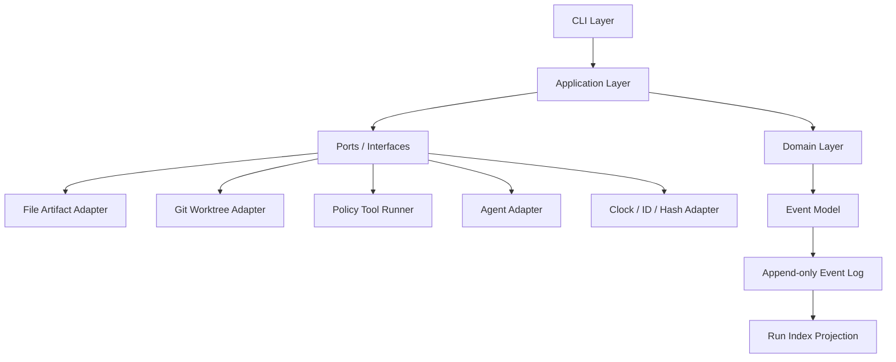
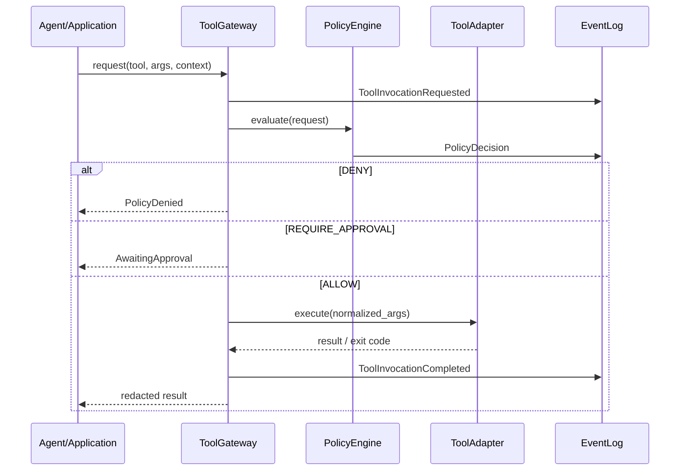

# VAF 技术方案文档

## 1. 文档目的

本文将 [VAF-PRD.md](./VAF-PRD.md) 中的 v0.1 产品需求转换为可实现的技术设计，重点解决：

- 领域对象和状态转换如何表达。
- 产物、运行事件、审批和追踪关系如何持久化。
- 工具调用如何经过 Policy Gateway，并做到可恢复、可审计、可幂等。
- 第一版如何在不接入真实 LLM、不部署云资源的情况下完成可验证的 Golden Change。

本文不设计 v0.2 的 staging 部署、v0.3 的生产发布、多租户和 Web 控制台；这些能力只保留适配器边界。

## 2. v0.1 技术范围

### 2.1 必须支持

```text
单一 Git 仓库
单一 Python/FastAPI 示例项目
单一 Change 的单一活动 Run
CLI 交互
本地 Markdown/YAML 产物
本地 append-only 运行事件
模拟 Agent / 模拟工具执行器
隔离 Git worktree
状态审批、驳回、重试、恢复、失效
策略拒绝、验证报告和 Trace Report
```

### 2.2 明确不支持

```text
真实生产部署
云资源和长期凭据
多项目、多租户、团队权限
真实 CI/CD 回调
多语言代码适配
Web UI
自动创建 PR、合并分支或覆盖用户当前工作树
```

### 2.3 技术基线

| 项目 | v0.1 决策 |
|---|---|
| 语言 | Python 3.11+ |
| CLI | Typer 或同等 CLI 框架 |
| 数据模型 | Pydantic 2 |
| 运行时状态 | 本地 append-only `events.jsonl` + 可重建索引 |
| 规格事实 | Git 中不可变 Markdown/YAML 版本 |
| 运行证据 | `.vaf/runs/<run-id>/`，大型证据只存 URI、哈希和摘要 |
| 编排 | 自有状态机内核；后续可接 LangGraph Adapter |
| 模型 | v0.1 使用 Fake Agent；真实 Provider 放在 Adapter 层 |
| 代码隔离 | Git worktree + 受限本地执行器；默认不接触当前工作树 |
| 测试 | pytest，辅以项目声明的格式化、Lint 和构建命令 |

## 3. 总体架构

### 3.1 分层



依赖规则：

- `domain` 不依赖 Typer、Pydantic 的具体 IO 适配器、Git、LangGraph 或模型 SDK。
- `application` 依赖领域对象和端口，不直接调用 Shell、文件系统或模型 SDK。
- `adapters` 实现端口，并负责外部错误转换、超时、脱敏和幂等查询。
- `cli` 只负责参数解析、命令展示和调用 Application Use Case。
- Agent 不能绕过 Application/Policy Gateway 直接取得文件、Shell 或 Git 对象。

### 3.2 组件职责

| 组件 | 主要职责 | v0.1 实现 |
|---|---|---|
| `ChangeService` | 创建、读取和校验 Change | Python service + YAML |
| `WorkflowService` | 启动、暂停、恢复和推进 Run | 自有状态机 |
| `ArtifactService` | 创建、审批、读取和失效产物 | Git 文件 + frontmatter |
| `GateService` | 执行自动规则并汇总人工审批 | Python Policy evaluator |
| `ToolGateway` | 拦截、授权和审计所有工具调用 | 强制 Python 入口 |
| `WorktreeService` | 检查仓库、创建和回收隔离 worktree | Git CLI Adapter |
| `VerificationService` | 执行验证命令并保存证据 | 白名单 Command Runner |
| `TraceService` | 校验和查询 TraceLink | YAML 索引 + 图校验 |
| `RunStore` | 追加事件、重建状态、查询运行 | JSONL + index.yaml |
| `AgentPort` | 生成结构化草稿 | Fake Agent first |

## 4. 领域模型

### 4.1 聚合边界

| 聚合 | 聚合根 | 一致性边界 |
|---|---|---|
| Change 聚合 | `Change` | 目标、范围、风险、活动 Run 锁 |
| WorkflowRun 聚合 | `WorkflowRun` | 事件序列、当前阶段、状态和预算 |
| Artifact 聚合 | `ArtifactVersion` | 产物哈希、版本、审批和失效关系 |
| ToolInvocation 聚合 | `ToolInvocation` | 策略决定、幂等键、执行状态和结果摘要 |
| Trace 聚合 | `TraceLink` | 对象存在性、版本有效性和关系完整性 |

聚合之间不通过可变对象直接互相修改，只通过命令、事件和不可变 ID/哈希引用关联。

### 4.2 核心对象

#### `Change`

```python
Change(
    change_id: ChangeId,
    project_id: ProjectId,
    title: str,
    source: str,
    objective: str,
    non_goals: list[str],
    risk_class: RiskClass,
    profile: Profile,
    status: ChangeStatus,
    created_by: ActorId,
    created_at: datetime,
    active_run_id: RunId | None,
)
```

不变量：

- `objective`、`source` 和 `non_goals` 不能为空。
- `profile` 不能低于规则根据 `risk_class` 判定的最低级别。
- 同一 `Change` 同一时间最多有一个会写入 worktree 的活动 Run。
- Change 关闭后不得再追加未关联的新版本产物。

#### `WorkflowRun`

```python
WorkflowRun(
    run_id: RunId,
    change_id: ChangeId,
    workflow_version: str,
    status: RunStatus,
    current_stage: StageId,
    current_stage_run_id: StageRunId | None,
    budget: RunBudget,
    head_event_id: EventId | None,
    created_at: datetime,
    updated_at: datetime,
)
```

Run 的当前状态是事件重放得到的投影，不作为唯一事实来源；事件日志不可原地修改。

#### `StageRun`

```python
StageRun(
    stage_run_id: StageRunId,
    run_id: RunId,
    stage_id: StageId,
    attempt: int,
    status: StageStatus,
    input_artifact_hashes: list[str],
    output_artifact_ids: list[ArtifactId],
    idempotency_namespace: str,
    started_at: datetime | None,
    finished_at: datetime | None,
    failure_code: str | None,
)
```

#### `ArtifactVersion`

```python
ArtifactVersion(
    artifact_id: ArtifactId,
    artifact_type: ArtifactType,
    change_id: ChangeId,
    version: int,
    status: ArtifactStatus,
    content_hash: str,
    file_path: str,
    depends_on: list[ArtifactRef],
    created_by: ActorId,
    created_at: datetime,
    approved_by: ActorId | None,
    approved_at: datetime | None,
    invalidated_by: ArtifactId | None,
)
```

已审批 `ArtifactVersion` 只能被引用，不能覆盖；修改必须创建新版本。

#### `Approval`

```python
Approval(
    approval_id: ApprovalId,
    target_type: str,
    target_id: str,
    target_hash: str,
    decision: ApprovalDecision,
    actor: ActorId,
    comment: str | None,
    created_at: datetime,
)
```

审批绑定 `target_hash`，防止用户审批旧版本却推进新版本。

#### `TraceLink`

```python
TraceLink(
    link_id: TraceLinkId,
    from_ref: VersionedRef,
    relation: TraceRelation,
    to_ref: VersionedRef,
    evidence_ref: EvidenceRef | None,
    status: TraceLinkStatus,
    created_by: ActorId,
    created_at: datetime,
)
```

v0.1 支持的关系：`derived_from`、`satisfies`、`implements`、`verifies`、`evidenced_by`、`invalidated_by`。

#### `ToolInvocation`

```python
ToolInvocation(
    invocation_id: InvocationId,
    run_id: RunId,
    stage_run_id: StageRunId,
    tool_name: str,
    normalized_args_hash: str,
    idempotency_key: str,
    policy_decision_id: PolicyDecisionId,
    status: InvocationStatus,
    intent_recorded_at: datetime,
    started_at: datetime | None,
    finished_at: datetime | None,
    exit_code: int | None,
    result_hash: str | None,
    redacted_summary: str | None,
)
```

## 5. 状态机与事件契约

### 5.1 Stage 状态

```text
PENDING -> RUNNING -> WAITING_REVIEW -> APPROVED
RUNNING -> BLOCKED | FAILED | CANCELLED
WAITING_REVIEW -> CHANGES_REQUESTED | REJECTED | EXPIRED
CHANGES_REQUESTED -> RUNNING
FAILED -> RETRYING -> RUNNING | ABORTED
APPROVED -> INVALIDATED
```

### 5.2 状态转换表

| 当前状态 | 命令/事件 | 守卫条件 | 下一状态 | 副作用 |
|---|---|---|---|---|
| `PENDING` | `StartStage` | 输入产物版本存在、Change 未锁定 | `RUNNING` | 创建 StageRun |
| `RUNNING` | `NeedInput` | 缺少信息且不能安全假设 | `BLOCKED` | 记录阻塞问题 |
| `RUNNING` | `DraftProduced` | 产物 Schema 通过 | `WAITING_REVIEW` | 固化 ArtifactVersion |
| `RUNNING` | `VerificationFailed` | 必需检查失败 | `FAILED` | 保存 Evidence |
| `RUNNING` | `CancelRun` | 发起者有权限 | `CANCELLED` | 停止可取消工具 |
| `WAITING_REVIEW` | `Approve` | 审批目标哈希等于当前哈希 | `APPROVED` | 写入 Approval |
| `WAITING_REVIEW` | `RequestChanges` | 评论非空 | `CHANGES_REQUESTED` | 保留旧版本 |
| `WAITING_REVIEW` | `Reject` | 拒绝理由非空 | `REJECTED` | 结束当前阶段 |
| `CHANGES_REQUESTED` | `Regenerate` | 新版本输入合法 | `RUNNING` | 创建新 StageRun |
| `FAILED` | `Retry` | 重试预算和策略允许 | `RETRYING` | 增加 attempt |
| `RETRYING` | `RetryStarted` | 幂等键已初始化 | `RUNNING` | 恢复执行 |
| `APPROVED` | `UpstreamInvalidated` | 引用的上游哈希发生变化 | `INVALIDATED` | 传播失效 |
| `FAILED` / `BLOCKED` | `Abort` | 具备结束权限 | `ABORTED` | 关闭 Run 或等待新 Change |

### 5.3 事件包络

所有事件使用相同包络：

```json
{
  "event_id": "EVT-20260805-000001",
  "event_type": "StageStarted",
  "schema_version": "1.0",
  "run_id": "RUN-001",
  "change_id": "CHG-001",
  "stage_run_id": "SR-001",
  "correlation_id": "CORR-001",
  "causation_id": "EVT-20260805-000000",
  "attempt": 1,
  "actor": "system",
  "occurred_at": "2026-08-05T12:00:00Z",
  "payload": {},
  "payload_hash": "sha256:..."
}
```

v0.1 至少实现以下事件：

```text
ChangeCreated
RunStarted
StageStarted
ArtifactDrafted
ArtifactApproved
ArtifactChangesRequested
StageBlocked
ToolInvocationRequested
PolicyDecisionMade
ToolInvocationCompleted
WorktreeCreated
CodeFileWritten
ImplementationCompleted
ImplementationFailed
VerificationCompleted
StageFailed
RetryRequested
StageInvalidated
RunCompleted
RunAborted
```

### 5.4 幂等和恢复

#### 幂等键

```text
idempotency_key = sha256(
  run_id + stage_run_id + tool_name + normalized_args_hash + attempt_scope
)
```

#### 执行协议

1. 追加 `ToolInvocationRequested`，状态为 `INTENT_RECORDED`。
2. 计算 PolicyDecision；拒绝时追加 `PolicyDecisionMade(DENY)`，禁止启动工具。
3. 允许时查询同一幂等键的历史结果。
4. 没有已完成结果时启动工具，并追加 `ToolStarted`。
5. 工具完成后保存退出码、结果哈希和脱敏摘要，追加 `ToolInvocationCompleted`。
6. 进程中断时，恢复器先查询外部状态；状态不明的调用进入 `BLOCKED`，不自动重复执行有副作用动作。

不能将“事件已经写入”当作“外部动作已经完成”；意图和结果必须是两个可区分的状态。

## 6. 事实来源与文件布局

### 6.1 目标仓库布局

```text
.vaf/
├── manifest.yaml
├── constitution.md
├── workflows/
│   └── default.yaml
├── artifacts/
│   └── <change-id>/
│       ├── 00-intake.md
│       ├── 01-prd.md
│       ├── 02-technical-design.md
│       ├── 03-test-cases.md
│       ├── 04-implementation-plan.md
│       ├── 05-verification-report.md
│       └── 06-trace-report.md
├── traces/
│   └── <change-id>.yaml
└── runs/
    └── <run-id>/
        ├── events.jsonl
        ├── index.yaml
        ├── evidence/
        └── redacted-log/
```

### 6.2 唯一事实来源

| 数据 | 事实来源 | 是否可覆盖 |
|---|---|---|
| 规格、审批、TraceLink | Git 中的不可变 ArtifactVersion | 不可覆盖，只能新增版本 |
| 状态事件 | `runs/<run-id>/events.jsonl` | 只能追加 |
| 当前 Run 查询状态 | `index.yaml` 投影 | 可重建，不是最终事实 |
| 测试日志、模型响应 | `evidence/` 或外部 URI | 内容不可变，允许生命周期清理 |
| 大文件证据 | URI + SHA-256 + 脱敏摘要 | 不在 Git 内原地更新 |

### 6.3 产物 frontmatter

```yaml
artifact_id: PRD-001
artifact_type: prd
change_id: CHG-001
version: 2
status: approved
content_hash: sha256:...
depends_on:
  - artifact_id: INTAKE-001
    content_hash: sha256:...
requirements:
  - REQ-001
created_by: fake-product-agent
created_at: 2026-08-05T12:00:00Z
approved_by: user
approved_at: 2026-08-05T12:05:00Z
```

提交前校验：frontmatter 可解析、字段完整、依赖哈希存在、正文标题符合模板、所有引用对象存在且版本有效。

## 7. Policy Gateway 设计

### 7.1 调用链



### 7.2 Policy 输入

```python
PolicyContext(
    project_id: str,
    change_id: str,
    run_id: str,
    stage_id: str,
    actor: str,
    profile: str,
    risk_class: str,
    tool_name: str,
    normalized_args: dict,
    workspace_root: str,
    network_mode: str,
    secret_refs: list[str],
)
```

### 7.3 v0.1 策略

| 工具 | 默认 | 约束 |
|---|---|---|
| `read_file` | Allow | 路径必须在项目上下文白名单内，敏感文件先脱敏 |
| `write_file` | Allow | 只写隔离 worktree，路径匹配任务范围 |
| `git_status` / `git_diff` | Allow | 只读当前 worktree |
| `git_worktree_add` | Allow | 目标目录由系统生成，不能由 Agent 指定任意路径 |
| `run_command` | RequireApproval/Allow | 命令和参数必须匹配项目白名单；默认无网络 |
| `network_request` | Deny | v0.1 禁止 |
| `read_secret` | Deny | v0.1 不提供明文读取能力 |
| `deploy_*` | Deny | v0.1 不部署 |

策略结果必须包含：`decision_id`、`decision`、`policy_version`、`rule_id`、`reason`、`expires_at` 和 `redaction_profile`。

## 8. Agent 与编排接口

### 8.1 Agent 端口

```python
class ArtifactDraftingAgent(Protocol):
    def draft(
        self,
        artifact_type: str,
        inputs: list[ArtifactRef],
        context: ContextSnapshot,
    ) -> DraftResult: ...
```

`DraftResult` 只能返回候选 Markdown、结构化 frontmatter 和假设/疑问列表，不允许直接改变阶段状态。

v0.1 使用 `FakeArtifactAgent`，输入固定 fixture，输出固定但可配置的草稿；这样可以测试状态机和校验器，不把模型波动混入内核验证。

### 8.2 Application Use Case

```python
class WorkflowApplication(Protocol):
    def start_run(self, change_id: str) -> RunView: ...
    def status(self, run_id: str) -> RunView: ...
    def review(self, run_id: str) -> ReviewView: ...
    def approve(self, run_id: str, target_hash: str, actor: str, comment: str | None) -> RunView: ...
    def reject(self, run_id: str, target_hash: str, actor: str, comment: str) -> RunView: ...
    def resume(self, run_id: str) -> RunView: ...
    def verify(self, run_id: str) -> RunView: ...
    def trace(self, run_id: str) -> TraceReport: ...
```

所有 Use Case 都必须：

- 校验当前状态和目标哈希。
- 通过事件日志提交状态变化。
- 在失败时返回稳定错误码和下一步建议。
- 不把完整模型响应或敏感工具输出直接打印到 CLI。

### 8.3 v0.1 工作流

```text
CreateChange
  -> ValidateIntake
  -> DraftPRD
  -> ValidateArtifact
  -> WaitPRDApproval
  -> DraftTechnicalDesign
  -> ValidateArtifact
  -> WaitDesignApproval
  -> DraftTestCases
  -> ValidateTraceCoverage
  -> DraftImplementationPlan
  -> CreateWorktree
  -> GenerateCodeCandidate
  -> RunVerification
  -> BuildTraceReport
  -> Complete
```

每一个节点都只处理一个明确的输入/输出契约；节点之间通过 ArtifactRef、EvidenceRef 和事件 ID 传递上下文，不传递未受控的超长对话。

## 9. Worktree 与验证执行

### 9.1 Worktree 生命周期

1. `vaf init` 前检查目标仓库是 Git 仓库。
2. 创建 Change 前记录当前分支、HEAD 和工作区状态摘要。
3. 创建 worktree 前申请 `change_id` 级锁。
4. Worktree 路径由 VAF 在项目专用临时目录生成，Agent 不得指定。
5. 生成前记录基线 commit；生成后只允许白名单路径变化。
6. 验证失败时保留 worktree 和 diff，等待 `resume` 或人工处理。
7. v0.1 不自动删除 worktree；后续版本提供显式清理命令，并先展示目标。

当前 M0 已将 worktree 创建、文件写入和验证命令接入 ToolGateway；验证失败后保留 worktree，但 CLI 暂不提供自动重试或清理命令。

### 9.2 命令白名单

项目在 `.vaf/manifest.yaml` 中声明验证命令，例如：

```yaml
verification:
  commands:
    - id: format-check
      argv: ["ruff", "format", "--check", "."]
      network: disabled
      timeout_seconds: 120
    - id: lint
      argv: ["ruff", "check", "."]
      network: disabled
      timeout_seconds: 120
    - id: unit-test
      argv: ["pytest", "-q"]
      network: disabled
      timeout_seconds: 300
```

系统不接受 Agent 提供的任意 Shell 字符串作为验证命令；Command Runner 只执行已经解析、归一化并通过策略的 `argv`。

### 9.3 验证证据

```yaml
evidence_id: EV-001
evidence_type: verification
run_id: RUN-001
command_id: unit-test
argv_hash: sha256:...
workspace_fingerprint: sha256:...
exit_code: 0
started_at: 2026-08-05T12:20:00Z
finished_at: 2026-08-05T12:20:04Z
stdout_uri: .vaf/runs/RUN-001/evidence/EV-001.stdout
stdout_hash: sha256:...
redaction_profile: default
```

## 10. Trace 校验

### 10.1 最小关系图

```text
REQ -> AC -> TC -> EV
REQ -> TASK -> CODE_DIFF
TASK -> TC
CODE_DIFF -> EV
```

### 10.2 v0.1 质量门

```text
AC 覆盖率 = 有至少一个通过 TC 的 AC 数 / 已批准 AC 总数
变更可解释率 = 有 TASK 与 REQ/AC 关联的非格式化代码文件数 /
               非格式化代码文件总数
```

两项必须都是 100%。格式化文件、生成缓存、构建产物和明确标记为非业务的配置文件需要在规则中声明，否则不能被静默排除。

M0 的实现不从代码 diff 自动推断语义关系，而要求实施计划在每个文件上显式声明 `requirement_ids`、`acceptance_ids` 和 `test_ids`。`verify` 保存执行时的 `workspace_fingerprint`；`trace` 会重新计算当前 worktree 指纹，指纹不一致时拒绝复用旧验证证据。

### 10.3 失效传播

```text
上游 ArtifactVersion 新版本审批
  -> 找到所有 depends_on 旧哈希的 ArtifactVersion
  -> 追加 StageInvalidated / TraceLinkInvalidated
  -> 阻止失效产物进入代码和验证阶段
  -> 生成待重新运行的最小阶段集合
```

失效传播必须是事件驱动且可重复执行；同一失效事件重复投递不能产生重复版本或重复任务。

## 11. 错误模型

### 11.1 稳定错误码

| 错误码 | 含义 | 用户动作 |
|---|---|---|
| `VAF-STATE-001` | 非法状态转换 | 查看当前状态和允许命令 |
| `VAF-ARTIFACT-001` | 产物 Schema 不通过 | 修复字段或重新生成 |
| `VAF-ARTIFACT-002` | 产物依赖哈希不存在 | 恢复正确版本或重新生成 |
| `VAF-POLICY-001` | 工具动作被拒绝 | 查看 rule_id，不得自动绕过 |
| `VAF-WORKTREE-001` | worktree 或锁冲突 | 检查活动 Run 和 Git 状态 |
| `VAF-TOOL-001` | 工具执行失败 | 查看 Evidence 和退出码 |
| `VAF-TOOL-002` | 工具状态不明 | 阻塞并人工确认外部状态 |
| `VAF-TRACE-001` | 追踪关系断链 | 补充 TraceLink 或重新生成 |
| `VAF-BUDGET-001` | Run 预算耗尽 | 审批追加预算或终止 Run |

### 11.2 错误处理规则

- Schema、引用和状态错误是确定性错误，不能交给 LLM 自行解释为成功。
- 工具非零退出码保留为真实失败证据，不能被自然语言总结覆盖。
- 不确定的外部副作用进入 `BLOCKED`，不自动重试。
- 可重试的模型/读取类错误使用有限指数退避，并增加 `attempt`。
- 每次自动修复有最大次数和预算，超过后转人工处理。

## 12. 可观测性与审计

### 12.1 最小指标

```text
vaf_run_duration_seconds
vaf_stage_duration_seconds
vaf_model_calls_total
vaf_model_cost_total
vaf_tool_invocations_total{tool,decision,status}
vaf_policy_denials_total{rule_id}
vaf_retries_total{stage,reason}
vaf_invalidated_artifacts_total
vaf_trace_coverage_ratio{type}
```

### 12.2 脱敏

日志写入前执行统一 `Redactor`：

- 删除常见 API key、Bearer、Cookie、Authorization、密码字段。
- 对 `.env`、私钥、云凭据文件默认拒绝读取。
- 对输入内容中的邮箱、手机号等个人信息按项目规则掩码。
- 记录脱敏发生的规则 ID，不记录原文。

### 12.3 审计不可变性

事件文件只允许追加；每条事件包含前一事件 ID 和 payload hash。v0.1 使用链式校验发现本地事件被修改；平台化后再增加远程不可变存储和签名。

## 13. 测试设计

### 13.1 单元测试

- 状态转换表：合法/非法转换、重复审批、过期审批。
- Artifact frontmatter：必填字段、哈希、版本、依赖和悬空引用。
- TraceLink：对象存在、版本有效、覆盖率计算。
- Policy Engine：命令、路径、网络和 Secret 场景。
- 幂等键：相同输入得到相同键，不同 attempt 的边界清楚。
- Redactor：密钥和授权头不出现在摘要与日志。

### 13.2 集成测试

- Event Log 写入后重建 Run 投影。
- 进程中断后 resume 不重复完成工具调用。
- Worktree 创建、白名单文件变化检查和锁释放。
- Fake Agent 输出产物后进入审批和失效传播。
- Fake Tool Runner 生成成功/失败/状态不明证据。

### 13.3 端到端验收夹具

| 夹具 | 覆盖能力 | 通过条件 |
|---|---|---|
| A 正常闭环 | 生成、审批、代码、验证、Trace | 100% 质量门通过 |
| B PRD 驳回 | 新版本、旧版本保留 | 下游旧哈希全部失效 |
| C 三处中断 | 恢复、幂等、事件重放 | 无重复副作用，结果一致 |
| D 越权动作 | 命令、路径、网络、Secret | 工具进程未启动，审计完整 |
| E 测试失败 | 真实退出码、失败报告 | 阶段保持失败，不生成成功结论 |

### 13.4 PRD 指标映射

| PRD 验收条件 | 技术测试位置 |
|---|---|
| AC-010～AC-014 | `tests/unit/test_state_machine.py`、`tests/integration/test_resume.py` |
| AC-015～AC-018 | `tests/unit/test_artifact_schema.py` |
| AC-029～AC-034 | `tests/unit/test_trace_validator.py`、`tests/unit/test_task_graph.py` |
| AC-035～AC-046 | `tests/integration/test_tool_gateway.py`、`tests/integration/test_worktree.py` |
| AC-047～AC-057 | `tests/integration/test_verification_report.py`、`tests/e2e/test_golden_change.py` |

## 14. 工程目录

```text
project/vaf/
├── README.md
├── VAF-PRD.md
├── VAF-Technical-Design.md
├── vaf-调研与架构规划.md
├── vaf-架构评审报告.md
├── pyproject.toml
├── src/vaf/
│   ├── cli/
│   ├── domain/
│   │   ├── ids.py
│   │   ├── models.py
│   │   ├── events.py
│   │   ├── states.py
│   │   └── errors.py
│   ├── application/
│   │   ├── workflow_service.py
│   │   ├── artifact_service.py
│   │   ├── policy_service.py
│   │   └── trace_service.py
│   ├── ports/
│   │   ├── agents.py
│   │   ├── artifacts.py
│   │   ├── event_store.py
│   │   ├── tools.py
│   │   └── workspace.py
│   ├── adapters/
│   │   ├── filesystem_artifacts.py
│   │   ├── jsonl_event_store.py
│   │   ├── fake_agent.py
│   │   ├── fake_tool_runner.py
│   │   └── git_worktree.py
│   ├── policy/
│   │   ├── engine.py
│   │   ├── rules.py
│   │   └── redaction.py
│   └── workflow/
│       ├── transitions.py
│       ├── runner.py
│       └── recovery.py
└── tests/
    ├── unit/
    ├── integration/
    ├── e2e/
    └── fixtures/
```

## 15. 实施顺序

### Slice 1：纯领域内核

已实现 IDs、领域模型、状态转换、错误码和事件包络，并通过标准库 unittest 验证。

### Slice 2：事件日志和产物 Schema

已实现 JSONL append、事件哈希链、事件回放式 Run 状态、frontmatter 解析、ArtifactVersion 和 TraceLink 校验。

### Slice 3：策略网关与 Fake Tool

已实现命令/路径/网络/Secret 规则、ToolGateway 审计、事件链持久化和跨进程幂等结果恢复。

### Slice 4：Worktree 与验证器

已接入真实 Git worktree、逐文件变更范围校验和受限验证命令；CLI 可通过 Policy Gateway 在隔离 worktree 中写入候选代码，并执行 unittest，保存脱敏、截断后的输出证据。

### Slice 5：Fake Agent 与 CLI

已完成 `init`、`run`、`status`、`review`、`approve`、`reject`、`resume`、`verify`、`trace`，支持 PRD → 技术方案 → 测试用例 → 实施计划的审批推进。

### Slice 6：Golden Change

已用固定文件计划跑通隔离 worktree、逐文件写入、范围校验、进程中断后幂等恢复和 worktree 内 unittest 验证；真实 FastAPI 业务生成和真实 LLM 仍保留在后续 Slice。

## 16. 架构决策记录

### ADR-001：v0.1 采用自有状态机，不直接绑定 LangGraph

**决定：** 状态、事件、转移和恢复规则由 VAF 领域内核定义；LangGraph 未来作为编排 Adapter。

**原因：** 便于无模型测试、避免领域层依赖运行时私有类型，也让后续迁移 Temporal 不改变业务规则。

### ADR-002：Git 是规格与审批事实来源

**决定：** 已审批 Markdown/YAML 产物进入 Git，以不可变版本和哈希引用；运行事件在本地 append-only 日志中保存。

**原因：** v0.1 需要透明、可复查和易回滚；数据库只在平台化后承担可重建投影。

### ADR-003：工具必须经过唯一 Policy Gateway

**决定：** Application 和 Agent 都不能直接调用 Shell、Git 或网络；所有工具动作必须经过 ToolGateway。

**原因：** Prompt 规则无法承担安全边界；统一入口才能实现命令、路径、网络、Secret、审计和幂等控制。

### ADR-004：v0.1 使用 Fake Agent

**决定：** 先用固定输入/输出的 Fake Agent 验证工作流内核，真实 LLM 只通过 AgentPort 接入。

**原因：** 将模型波动与状态机、Schema、策略和恢复问题隔离，先证明系统可控。

## 17. 技术方案验收清单

- [ ] 领域对象、ID、错误码和枚举已定义。
- [ ] 状态转换表和非法转换测试已定义。
- [ ] 事件包络、JSONL 存储和投影重建已定义。
- [ ] ArtifactVersion、TraceLink、PolicyDecision Schema 已定义。
- [ ] 唯一事实来源和失效传播规则已定义。
- [ ] ToolGateway 覆盖所有外部动作且没有旁路 Shell。
- [ ] 幂等调用、状态不明和恢复规则已定义。
- [ ] Worktree、路径白名单和验证命令执行规则已定义。
- [ ] 五个 Golden Change 验收夹具已映射到测试文件。
- [ ] v0.1 不包含真实 LLM、云部署和生产权限。

## 18. 当前实现状态与下一步

当前 M0 已完成 Slice 1–6 的最小可运行闭环，并有 29 个 unittest 覆盖领域、Policy、审批旧哈希拒绝、事件恢复、worktree、代码写入、验证证据失效和 CLI 集成场景。代码生成仍使用显式文件计划驱动的 FakeAgent；当前只实现显式 TraceLink 和覆盖率质量门，真实 LLM、语义关系自动推断、CI/CD 和部署适配器不在当前实现内。

下一批实现建议为：

```text
1. AgentPort Provider：接入一个真实 LLM Provider，保留 Fake Agent 作为确定性回归夹具。
2. 产物依赖失效传播：在多阶段上游版本变化时阻止下游旧产物继续执行。
3. 回归测试与 CI/CD Adapter：先 staging，再设计生产审批和回滚。
```
