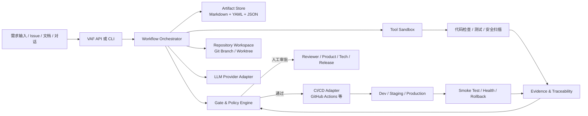
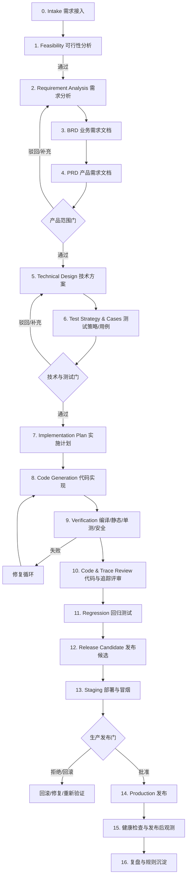

# VAF：企业级 AI 软件研发工作流调研与架构规划

> 状态：方案评审稿
>
> 日期：2026-08-05
>
> 项目代码目录：`/Users/wanjiaheng/Documents/工作/workspace/ai-agent/project/vaf`
>
> 参考文档：`/Users/wanjiaheng/Documents/工作/workspace/ai-agent/vibe-coding/ai-agent-workflow.md`

## 1. 先给结论

建议把 VAF 定位成：

> 一个以规格文档为事实来源、以阶段门为质量约束、以 Agent 为执行者、以 CI/CD 为交付出口的 AI 软件研发控制平面。

VAF 不应该只是“让大模型从一句话直接写代码”，也不建议一开始就做一个复杂的多 Agent 平台。第一版应优先解决四个问题：

1. 需求如何被结构化并沉淀为 BRD、PRD、技术方案、测试用例等可审阅产物。
2. 每个阶段如何有明确输入、输出、校验规则和通过条件。
3. 需求、设计、任务、代码、测试结果、部署记录之间如何建立可追溯关系。
4. 生成代码如何经过隔离执行、自动测试、人工审批后才能进入测试环境或生产环境。

一句话架构建议：

> `Markdown/YAML 规格资产 + LangGraph 工作流运行时 + Pydantic 校验器 + Git 分支/工作树 + GitHub Actions 部署适配器`。

后续当工作流需要跨天恢复、分布式 Worker、强一致重试和多项目并发时，再把执行层替换或扩展为 Temporal；不要在 MVP 阶段为了“企业级”提前引入过重基础设施。

## 2. VAF 要解决的问题

现有 `ai-agent-workflow.md` 已经包含一个针对代码迁移的 5 步强制流程：迁移分析、领域分析、代码生成、错误分析、规范更新。它的优点是强调完整调用链、分层约束、外部系统对接和错误沉淀；局限是：

- 它面向特定的 Java 服务迁移场景，不是通用产品研发流程。
- 阶段产物主要体现在检查清单中，缺少统一的文档对象、状态、版本和追踪关系。
- 人工确认点没有被建模为可恢复的工作流状态。
- 测试、回归、发布、回滚、运行观测尚未形成端到端闭环。
- 代码生成与部署的权限边界、密钥隔离、沙箱和审批策略没有独立抽象。

因此，VAF 可以把现有文档中的“强约束检查思想”保留下来，升级为可编排的通用研发流水线；其中领域分析、DDD 分层、Gateway 检查等内容应成为可插拔的领域规则包，而不是写死在核心引擎里。

## 3. 网上类似方案调研

### 3.1 GitHub Spec Kit

[GitHub Spec Kit](https://github.github.com/spec-kit/) 是目前最值得参考的开源 SDD（Spec-Driven Development）工具之一。它把开发过程组织为结构化阶段，默认主线是 `Spec → Plan → Tasks → Implement`，每个阶段产生 Markdown 产物，并允许自定义扩展、预设和工作流；文档还强调可以离线运行、适配多个 Coding Agent。

可借鉴点：

- 把“意图”和“规格”放在代码旁边，而不是只存在于一次聊天上下文里。
- 使用文件化产物作为跨会话、跨 Agent 的共享上下文。
- 工作流、模板、扩展和组织级规则可以拆开，避免把所有约束写进一个超长 Prompt。

不足：

- 核心流程更偏向 Spec、Plan、Tasks、Implement，没有覆盖 BRD、可行性分析、回归管理和生产发布治理。
- 它更像研发过程工具包，不是完整的执行控制平面。

VAF 的选择：借鉴其“规格是中心资产”和“工作流可扩展”的思想，但不直接把 Spec Kit 当作 VAF 的运行时依赖。

### 3.2 BMAD Method

[BMAD Method](https://docs.bmad-method.org/) 强调使用不同角色和工作流，把需求澄清、计划审批、实现和评审串起来；官方概括为“澄清重要事项、给出待审批计划、执行变更、复查结果”。它比简单的代码 Agent 更接近完整软件研发过程。

可借鉴点：

- 用产品、架构、开发、测试等角色分离上下文和职责。
- 在实现前先完成可审阅的计划。
- 把“评审 Agent”作为正式阶段，而不是代码生成后的可选动作。

不足：

- 它主要提供方法论、Agent 角色和工作流，不直接解决 VAF 需要的统一运行状态、产物索引、部署策略和回滚记录。
- 如果简单复制全部角色，容易出现“多 Agent 只是轮流写 Prompt”的表面复杂度。

VAF 的选择：借鉴角色分工，但优先采用“少量专职 Agent + 大量确定性校验器”的组合。

### 3.3 Kiro Specs

[Kiro Feature Specs](https://kiro.dev/docs/specs/feature-specs/) 的核心产物是 `requirements.md`、`design.md` 和 `tasks.md`。它支持 Requirements-First 和 Design-First 两种路径，并使用 EARS 形式表达可测试需求，例如 `WHEN ... THE SYSTEM SHALL ...`；在进入设计前，还可以专门分析需求中的歧义、冲突和缺口。

可借鉴点：

- 需求必须能转换成可验证的行为和验收条件。
- 需求分析、设计和任务拆解之间存在明确顺序，也允许设计先行的技术约束场景。
- “分析需求”应该是一个正式步骤，而不是生成 PRD 时顺手完成。

不足：

- 更贴近 IDE/CLI 产品体验，不能直接当作独立的企业研发控制平面。
- 没有覆盖 VAF 所需的 BRD、测试矩阵、回归基线、部署审批和生产回滚链路。

VAF 的选择：采用“需求先行 + 设计先行”双模式，并将 EARS/Gherkin 作为需求到测试用例之间的桥梁。

### 3.4 OpenSpec

[OpenSpec](https://openspec.dev/) 更轻量，也更强调 Brownfield（已有代码库）场景。它将规格放在代码仓库中，并为一次变更生成 `proposal.md`、`design.md`、`tasks.md` 和规格增量；其官方文档明确主张规格和变更通过 Git 协作，并保留为长期上下文。

可借鉴点：

- “变更包”比“每次重新生成整个项目文档”更适合日常开发。
- 规格增量能表达新增、修改、废弃的行为，适合处理需求演进。
- 先检索已有规格和代码，再生成变更方案，适合企业老项目。

不足：

- 流程故意保持轻量，不承担完整的企业发布治理。
- 对可行性分析、BRD、测试执行、部署和运维闭环覆盖较少。

VAF 的选择：把 OpenSpec 的“变更包”和“规格增量”吸收为 VAF 的 Change Proposal 机制。

### 3.5 Tessl 与软件工厂类方案

[Tessl](https://docs.tessl.io/) 更关注 Coding Agent 的上下文、技能和上下文资产生命周期；[Factory Software Factory](https://factory.ai/product/software-factory) 则展示了代码质量、依赖安全、文档同步、API 契约漂移等自动化软件工厂能力。这类方案提示了一个重要事实：生产级 Agent 系统的关键不只是生成代码，还包括规则分发、上下文治理、质量扫描和持续维护。

VAF 不建议第一版复制完整平台能力，而应预留以下扩展点：

- Repository Constitution / 项目级规则。
- Skills / 领域能力包。
- Context Provider / 代码库、接口、数据库和历史变更上下文提供器。
- Quality Policy / 质量与安全规则包。
- Evaluation / Prompt、Agent 和流程版本的评测集。

### 3.6 调研结论对比

| 方案 | 主要解决的问题 | 最值得借鉴的部分 | VAF 需要补足的部分 |
|---|---|---|---|
| Spec Kit | 规格驱动的研发主线 | Spec → Plan → Tasks → Implement、可扩展工作流 | BRD、测试、部署、回滚、统一控制平面 |
| BMAD | 角色化的全流程 Agent 方法 | 需求澄清、计划审批、实现、评审 | 运行状态、产物索引、权限与部署治理 |
| Kiro Specs | 需求到设计到任务 | EARS、需求分析、双向流程 | 独立于 IDE 的企业执行层、回归发布闭环 |
| OpenSpec | Brownfield 变更规格管理 | 变更包、规格增量、规格入库 | 多阶段研发、测试执行、部署治理 |
| Tessl | Agent 上下文与技能资产 | Skills、Context 生命周期 | 面向完整项目交付的状态机和审批 |

## 4. VAF 的核心设计原则

### 4.1 规格优先，但不是文档瀑布

规格不是一次性写完的长文档，而是随着代码、测试和反馈持续演进的版本化资产。允许在实现阶段发现问题后回退到 PRD 或技术方案，但必须记录变更原因和影响范围。

### 4.2 阶段门优先于 Agent 自由发挥

Agent 可以提出方案、调用工具和生成产物，但不能自行跳过阶段门。阶段门应由机器校验器和人共同决定：

- 机器判断格式、字段、引用、静态分析、测试和安全扫描。
- 人判断业务价值、范围、风险、体验和生产发布授权。

### 4.3 需求是可追踪的图，而不是散落的 Markdown

每个需求必须有稳定 ID，例如 `REQ-001`；它可以关联 BRD 目标、PRD 用户故事、验收条件、设计决策、实现任务、代码变更、测试用例、测试执行和部署版本。

### 4.4 生成和验证必须分离

负责生成代码的 Agent 不应同时担任最终质量裁判。VAF 至少要有独立的验证阶段，必要时使用不同模型、不同 Prompt 或完全确定性的工具。

### 4.5 生产部署默认有人审批

“自动化部署”不等于“无人值守地把任意生成代码推到生产”。默认策略应是自动部署到开发/临时环境，自动验证后进入 staging，生产环境由策略和人工审批共同控制；低风险项目可以显式配置为自动发布。

## 5. 推荐的总体架构

### 5.1 逻辑架构



### 5.2 组件职责

| 组件 | MVP 方案 | 后续演进 | 主要职责 |
|---|---|---|---|
| Workflow Orchestrator | LangGraph | Temporal + Worker 集群 | 阶段编排、暂停、恢复、重试、分支和合并 |
| Artifact Store | 本地文件系统 + Git | PostgreSQL 元数据 + S3/对象存储 | 保存文档、版本、执行日志和证据 |
| Gate & Policy | Pydantic 校验 + Python 规则 | 独立 Policy DSL / OPA | 阶段门、审批策略、风险阈值和发布条件 |
| Repository Workspace | Git CLI + 临时 worktree | 隔离 Runner / 容器任务 | 读取代码、生成变更、创建分支和提交候选 |
| Tool Sandbox | Docker 容器 | 微 VM / Kubernetes Job | 限制代码执行、网络、文件和凭据权限 |
| LLM Adapter | OpenAI/兼容 API 抽象 | 多模型路由、成本和质量策略 | 统一模型调用、结构化输出、重试和审计 |
| CI/CD Adapter | GitHub Actions | GitLab/Jenkins/云厂商适配器 | 构建、测试、制品、部署和环境状态 |
| Evidence/Trace | YAML 索引 + 报告 | 查询 API、图谱和评测平台 | 需求到代码、测试、部署的证据链 |

### 5.3 为什么推荐 LangGraph 起步

VAF 的工作流需要阶段状态、人工暂停、恢复、失败重试和上下文检查点。[LangGraph 的官方文档](https://docs.langchain.com/oss/python/langgraph/persistence)将 Checkpointer 用于图状态持久化、人工介入、时间旅行调试和故障恢复，这与 VAF 的 MVP 需求匹配。

推荐采用：

- LangGraph 只负责“工作流状态与节点编排”。
- Agent 的提示词、工具权限、产物模板和校验器放在 VAF 自己的领域层。
- 不把整个项目上下文塞进一个图状态；大型文档和代码放 Artifact Store，状态中只保存引用、摘要和哈希。

### 5.4 什么时候升级到 Temporal

[Temporal](https://docs.temporal.io/) 的核心优势是故障后从中断位置继续执行，并面向长时间运行、分布式任务和生产部署提供持久化执行语义。满足以下任意条件时再考虑 Temporal：

- 一个研发流程可能运行数小时、数天，且跨多次人工审批。
- 需要多个 Worker 并发运行多个项目或多个代码任务。
- 需要强约束的活动重试、超时、心跳、补偿和任务队列。
- VAF 本身成为团队共享平台，而不是单机 CLI。

在此之前，LangGraph + Postgres 已足以支撑验证产品价值的 MVP。

## 6. VAF 的标准研发工作流

### 6.1 主流程



### 6.2 阶段契约

| 阶段 | 关键输入 | 必须产物 | 自动检查 | 默认审批人 |
|---|---|---|---|---|
| Intake | 原始需求、Issue、对话 | `intake.md`、范围草案 | 必填字段、目标、非目标、来源 | 需求发起人 |
| 可行性分析 | Intake、现有代码/系统上下文 | `feasibility.md`、风险清单、选项对比 | 依赖扫描、成本/工期/技术风险字段 | 技术负责人 |
| 需求分析 | 原始需求、可行性结论 | `requirements-analysis.md`、问题清单 | 歧义、冲突、缺口、假设 | 产品负责人 |
| BRD | 业务目标和范围 | `brd.md`、业务流程、成功指标 | 目标-范围-指标一致性 | 业务/产品 |
| PRD | BRD、用户场景 | `prd.md`、用户故事、验收条件、非功能需求 | REQ ID、EARS/Gherkin、边界场景 | 产品负责人 |
| 技术方案 | PRD、代码库、约束 | `technical-design.md`、ADR、接口/数据模型、迁移方案 | 架构约束、依赖、容量、安全 | 架构/技术负责人 |
| 测试设计 | PRD、技术方案 | `test-strategy.md`、`test-cases.md`、`regression-plan.md` | 需求覆盖率、正反例、风险场景 | 测试负责人 |
| 实施计划 | 技术方案、测试用例 | `implementation-plan.md`、任务 DAG | 依赖顺序、任务边界、验收条件 | 开发负责人 |
| 代码实现 | 实施计划、项目规则 | 分支/工作树中的代码、变更说明 | diff 范围、禁止文件、格式化 | 开发 Agent |
| 验证 | 代码、测试资产 | 测试报告、扫描报告、制品元数据 | 编译、Lint、单测、集成、SAST、依赖/密钥扫描 | 验证 Agent |
| 回归 | 基线、变更影响 | 回归报告、失败分析、残余风险 | 影响范围与用例选择可解释 | 测试负责人 |
| 发布 | 所有前置报告 | 发布说明、版本、部署计划、回滚方案 | 版本、制品、迁移和回滚可用 | 发布负责人 |
| 生产 | staging 证据、审批 | 部署记录、健康检查、观测链接 | 环境保护、并发锁、冒烟、健康指标 | 发布审批人 |
| 复盘 | 运行结果、人工反馈 | `retrospective.md`、规则/Prompt 更新建议 | 失败模式分类、证据完整性 | VAF 管理者 |

### 6.3 阶段门的统一状态

每个阶段都使用相同的生命周期：

```text
PENDING -> RUNNING -> WAITING_REVIEW -> APPROVED
                         |                 |
                         v                 v
                      CHANGES_REQUESTED  FAILED
                                           |
                                           v
                                      RETRY / ABORT
```

阶段不能仅根据 Agent 输出文本判断成功，必须同时满足：

- 产物存在且符合 Schema。
- 产物中的引用对象存在，不能出现悬空 REQ/TASK/TC ID。
- 所有必需的自动检查通过。
- 该阶段的风险阈值没有超限，或者已经完成相应人工审批。
- 产物和输入的内容哈希、模型版本、Prompt 版本、工具调用和执行日志可审计。

## 7. 产物与追踪模型

### 7.1 推荐的项目内目录

VAF 自己是一个控制平面项目；接入某个业务代码仓库时，建议在目标仓库中创建 `.vaf/`：

```text
.vaf/
├── manifest.yaml                 # 项目、语言、环境、工作流版本
├── constitution.md              # 项目规则、架构约束、安全边界
├── context/                     # 代码库、接口、数据库、运行环境摘要
├── workflows/
│   └── default.yaml             # 阶段图和策略引用
├── artifacts/
│   └── <change-id>/
│       ├── 00-intake.md
│       ├── 01-feasibility.md
│       ├── 02-requirements-analysis.md
│       ├── 03-brd.md
│       ├── 04-prd.md
│       ├── 05-technical-design.md
│       ├── 06-test-strategy.md
│       ├── 07-test-cases.md
│       ├── 08-implementation-plan.md
│       ├── 09-verification-report.md
│       ├── 10-regression-report.md
│       ├── 11-release.md
│       └── 12-retrospective.md
├── traces/
│   ├── requirements.yaml         # REQ -> design/task/code/test/deploy
│   └── decisions.yaml            # ADR 与变更记录
└── runs/
    └── <run-id>/                 # 日志、事件、证据索引、模型调用摘要
```

### 7.2 统一 ID 规则

```text
REQ-001       需求
BRD-001       业务目标/业务流程
US-001        用户故事
AC-001        验收条件
ADR-001       架构决策
API-001       接口契约
TASK-001      实施任务
TC-001        测试用例
REG-001       回归用例
EV-001        证据记录
REL-001       发布记录
```

追踪关系至少覆盖：

```text
REQ -> US -> AC -> ADR/API -> TASK -> CODE_DIFF -> TC/REG -> EV -> REL
```

### 7.3 结构化 Markdown

人阅读的内容使用 Markdown，机器读取的元数据放在 YAML frontmatter 中，例如：

```markdown
---
artifact_id: PRD-2026-001
artifact_type: prd
change_id: CHG-2026-001
status: approved
version: 1
depends_on:
  - BRD-001
requirements:
  - REQ-001
owner: product-agent
reviewers:
  - product-owner
---

# PRD：订单批量导入

## REQ-001：导入校验

WHEN 用户上传格式正确但包含重复订单号的文件
THE SYSTEM SHALL 拒绝重复数据并返回可定位到行号的错误信息

### 验收条件

- `AC-001`：重复订单号能被识别。
- `AC-002`：错误报告包含文件名、行号和字段名。
```

## 8. Agent 与工具设计

### 8.1 建议的角色集合

| 角色 | 任务 | 可以做 | 不可以做 |
|---|---|---|---|
| Facilitator | 澄清需求和识别未知项 | 提问、整理假设、拆分范围 | 直接改生产代码 |
| Feasibility Analyst | 技术、成本、依赖和风险分析 | 读取代码库、查依赖、提出方案 | 承诺未经验证的工期 |
| Business Analyst | BRD 和业务流程 | 组织目标、角色、流程、指标 | 自行扩大产品范围 |
| Product Analyst | PRD 和验收条件 | 生成用户故事、边界、优先级 | 绕过产品审批 |
| Solution Architect | 技术方案和 ADR | 设计模块、接口、数据和迁移 | 直接执行生产变更 |
| Test Architect | 测试策略、测试和回归用例 | 建立覆盖矩阵、风险场景 | 只生成“全都通过”的空测试 |
| Developer | 代码与测试实现 | 在隔离分支中修改代码 | 读取或输出生产密钥 |
| Reviewer | 质量、架构、追踪评审 | 检查 diff、规则和证据 | 复用开发 Agent 的自评结论 |
| Release Operator | 构建、部署、健康检查 | 调用 CI/CD 适配器 | 绕过发布门直接上线 |

### 8.2 不要把所有事情都交给 Agent

确定性工作应优先交给工具：

- Markdown/YAML Schema 校验：Pydantic、JSON Schema。
- ID 和引用完整性：图索引校验器。
- 代码格式化、编译、Lint、单元测试：项目原生命令。
- SAST、依赖漏洞、密钥扫描：安全扫描器。
- Git diff、文件白名单、分支和提交检查：Git 工具层。
- 部署状态、环境锁、健康检查：CI/CD 和运行平台 API。

Agent 主要处理需要语义判断的工作：理解业务、提出方案、补齐测试场景、解释失败、做风险排序和生成修复建议。

### 8.3 工具权限分级

```text
READ_ONLY
  读取代码、文档、Git 历史、依赖信息

WORKSPACE_WRITE
  只允许写入当前 worktree，禁止访问工作区外路径

EXECUTE_TEST
  只允许运行白名单测试和构建命令，网络默认关闭

PUBLISH_ARTIFACT
  允许创建分支、提交候选、上传制品或评论

DEPLOY_STAGING
  需要策略通过，使用短期身份

DEPLOY_PRODUCTION
  必须经过环境保护和人工/策略审批，默认禁止 Agent 直接调用
```

## 9. 自动化部署与安全边界

### 9.1 推荐的发布链路

```text
生成变更
  -> 创建隔离分支
  -> PR / 变更评审
  -> CI 构建、测试、安全扫描
  -> 生成不可变制品
  -> 自动部署 Dev
  -> 自动部署 Staging
  -> 冒烟与回归
  -> 生产审批
  -> Canary / Blue-Green / Rolling 发布
  -> 健康检查
  -> 自动或人工回滚
```

GitHub Actions 的 Environments 支持 required reviewers、分支限制、环境密钥、并发控制和保护规则；VAF 可以把发布门映射到这些能力上。生产部署还应使用 [GitHub Actions OIDC](https://docs.github.com/en/actions/concepts/security/openid-connect) 获取短期云凭据，避免把长期云密钥复制到仓库 Secrets 中。

### 9.2 生产发布硬规则

- Agent 不能在宿主机上直接执行任意 `rm`、数据库写操作或云平台命令。
- 生成代码必须在临时分支或 worktree 中完成，不能直接覆盖用户未提交修改。
- 测试和构建容器默认无网络；确需网络时使用域名白名单。
- 任何密钥、Cookie、Authorization Header、`.env` 内容都不能进入 Prompt、日志、产物或测试报告。
- 生产部署使用不可变制品，不直接从 Agent 工作目录打包。
- 数据库迁移必须生成回滚/前向兼容方案，并在 staging 先验证。
- 发布必须有健康指标、超时、并发锁和回滚入口。
- “自动通过”只能适用于明确配置的低风险规则，不能作为全局默认。

## 10. 技术选型的三个方案

### 方案 A：轻量 CLI + 文件产物

```text
Python CLI + Pydantic + 本地 Markdown/YAML + Git + Docker + GitHub Actions
```

优点：实现快、容易调试、文件产物透明、适合个人学习和 MVP。

缺点：并发、跨机器恢复、Web 交互和权限模型较弱。

适用：VAF 第一阶段，建议必选。

### 方案 B：LangGraph + FastAPI + PostgreSQL

```text
FastAPI + LangGraph + PostgreSQL + 对象存储 + Redis/队列 + GitHub Actions
```

优点：支持暂停恢复、人工介入、Web UI、运行记录和多项目管理，复杂度仍可控。

缺点：需要管理服务端状态、队列、模型调用成本和执行隔离。

适用：VAF 第二阶段，推荐作为主线架构。

### 方案 C：Temporal + Worker 集群

```text
API + Temporal + 多语言 Worker + PostgreSQL/对象存储 + Sandbox Runner
```

优点：长流程、分布式执行、重试、超时、任务队列和故障恢复能力强。

缺点：基础设施和开发模型更重，需要更成熟的运维能力。

适用：多团队、多仓库、长时间运行和企业平台化阶段。

### 方案 D：Dify/n8n 作为编排核心

优点：原型搭建快，适合验证 Agent 节点、人工审批和外部系统连接。

缺点：代码仓库隔离、结构化产物、版本化状态、复杂重试、可测试性和生产发布治理需要大量外围补丁。

适用：做流程概念验证或演示，不建议作为 VAF 最终执行内核。

### 推荐组合

```text
第一阶段：方案 A
第二阶段：方案 B
第三阶段：方案 B + Temporal 能力，必要时迁移为方案 C

Spec Kit / BMAD / OpenSpec：借鉴方法和产物，不作为 VAF 的核心运行时依赖
Dify / n8n：作为外部集成或快速实验适配器
```

## 11. MVP 规划

### 11.1 MVP 目标

输入一条小型、边界清晰的功能需求，VAF 能够：

1. 生成并校验可行性分析。
2. 生成需求分析、BRD、PRD，并暂停等待人工确认。
3. 生成技术方案、测试策略、测试用例和实施任务。
4. 在隔离分支中生成代码和测试。
5. 执行格式化、编译、单测、集成测试和基础安全扫描。
6. 生成需求追踪矩阵、验证报告和回归报告。
7. 通过 GitHub Actions 部署到 staging。
8. 在人工审批后部署 production；失败时提供回滚入口。

### 11.2 MVP 范围内的命令

```bash
vaf init                    # 初始化 .vaf/ 项目规则和目录
vaf run --change <id>       # 启动一次工作流
vaf status --run <id>       # 查看阶段和审批状态
vaf review --run <id>       # 输出当前阶段待审阅产物
vaf approve --run <id>      # 审批当前阶段
vaf reject --run <id>       # 驳回并附带意见
vaf resume --run <id>       # 从检查点继续
vaf verify --run <id>       # 执行确定性验证
vaf trace --run <id>        # 生成需求追踪矩阵
vaf deploy --env staging    # 触发测试环境部署
```

命令名称是规划，不要求第一版全部实现；建议先做 `init`、`run`、`status`、`approve`、`resume` 和 `verify`。

### 11.3 里程碑

| 里程碑 | 交付内容 | 通过标准 |
|---|---|---|
| M0 运行骨架 | CLI、配置、阶段状态、文件产物、模拟模型 | 能运行一个无模型的 Hello Workflow |
| M1 文档流水线 | Intake → 可行性 → BRD → PRD → 技术方案 → 测试用例 | 每阶段有 Schema、报告和审批暂停 |
| M2 代码流水线 | 任务拆解 → worktree → 代码/测试生成 → 验证 | 能在示例项目上生成可运行代码 |
| M3 追踪与回归 | REQ/TASK/TC/EV/REL 追踪、影响分析、回归选择 | 能解释每个需求是否被实现和验证 |
| M4 staging 发布 | GitHub Actions、Docker、staging、冒烟 | 通过阶段门后自动部署 staging |
| M5 生产治理 | 环境保护、OIDC、审批、健康检查、回滚 | 默认不会绕过生产发布门 |

## 12. 建议的代码工程结构

`project/vaf` 作为 VAF 的代码项目，后续可以按以下方向演进：

```text
project/vaf/
├── README.md
├── pyproject.toml
├── src/vaf/
│   ├── cli/                    # vaf 命令行
│   ├── api/                    # FastAPI 接口（第二阶段）
│   ├── domain/                 # WorkItem、Stage、Artifact、Gate、TraceLink
│   ├── application/            # 用例编排、审批、恢复、报告
│   ├── workflow/               # LangGraph/Temporal 适配和状态图
│   ├── agents/                 # Agent 角色、Prompt、输出协议
│   ├── artifacts/              # Markdown/YAML 模板和解析器
│   ├── validators/             # Schema、引用、覆盖率、策略校验
│   ├── tools/                  # Git、文件、测试、扫描、沙箱工具
│   ├── adapters/               # LLM、GitHub、CI/CD、对象存储适配器
│   └── policies/               # 项目规则、风险等级、发布策略
├── tests/
│   ├── unit/
│   ├── integration/
│   └── fixtures/
└── .github/workflows/          # VAF 自身的 CI
```

依赖方向建议：

```text
domain <- application <- workflow/api/cli
domain <- validators/policies
adapters/tools 实现 domain/application 所需的端口接口
agents 只能通过工具端口和产物端口工作，不能直接操作基础设施
```

## 13. 关键风险与缓解措施

| 风险 | 表现 | 缓解措施 |
|---|---|---|
| 需求幻觉 | Agent 自行补充未确认业务规则 | 假设清单、疑问清单、PRD 审批门、禁止隐式扩大范围 |
| 文档漂移 | 代码变了，PRD/测试仍是旧版本 | 变更必须关联 Change ID，CI 检查规格与代码/测试追踪 |
| 流程过重 | 简单需求也走完整企业流程 | 按风险提供 Lite/Standard/Enterprise 三种 Profile |
| 多 Agent 失控 | 角色互相覆盖、成本高、结论冲突 | 少角色、强产物契约、确定性校验、有限重试 |
| 测试假通过 | 生成没有断言价值的测试 | 测试质量检查、变异测试抽样、独立测试评审 |
| 代码执行风险 | Agent 执行危险命令或读取密钥 | 容器/微 VM、命令白名单、网络隔离、凭据短期化 |
| 生产误发布 | 错误代码直接上线 | 环境保护、人工审批、并发锁、不可变制品、回滚 |
| 成本失控 | 每个阶段重复发送巨大上下文 | 上下文摘要、引用优先、缓存、模型路由和预算门 |
| 失败不可恢复 | 中断后只能重新生成全部文档 | 每阶段 checkpoint、幂等工具、产物哈希和 run event |
| 规则不适配 | 不同项目语言和组织规范不同 | Constitution、Profile、Policy Pack、Adapter 机制 |

## 14. 需要在后续评审中确定的决策

第一版不必现在全部拍板，但建议按以下顺序确认：

1. VAF 首个示例项目是什么：建议选一个小型 FastAPI CRUD 或前端全栈功能，确保能走完整测试和部署。
2. 第一版是否只支持 Python：建议是。先把流程跑通，再增加 Java/Node 适配器。
3. 工作流产物是否全部提交到目标 Git 仓库：建议是；运行日志和大文件证据可放对象存储，只在仓库保留索引。
4. 默认工作流 Profile：建议同时提供 `lite`、`standard`，把完整企业流程设为 `enterprise`，避免日常小改动过重。
5. 首个部署目标：建议 GitHub Actions + Docker + staging；云平台部署使用 Adapter，不在核心包内写死。
6. 是否需要 Web UI：建议 M0/M1 只做 CLI，M2 有真实使用反馈后再做 FastAPI + 简单审批界面。
7. 是否把现有迁移流程直接纳入：建议作为 `migration-java-ddd` Policy Pack，不要污染通用主流程。

## 15. 推荐的下一步实现顺序

```text
第 1 步：定义领域对象和状态机
  WorkItem / WorkflowRun / StageRun / Artifact / Gate / Evidence / TraceLink

第 2 步：定义产物 Schema 和 Markdown 模板
  先覆盖 intake、feasibility、brd、prd、design、test-cases

第 3 步：实现无模型的模拟工作流
  用固定样例验证阶段推进、暂停、驳回、恢复、失败和重试

第 4 步：接入一个 LLM Provider
  强制结构化输出；模型只生成草稿，校验器决定是否可进入下一阶段

第 5 步：接入 Git worktree 和确定性验证器
  生成代码、运行测试、保存 diff 和 evidence

第 6 步：接入 GitHub Actions staging 部署
  先做构建和 staging，不先做生产无人值守

第 7 步：用两个真实小项目做评测
  对比自由 Prompt、Spec Kit 风格流程和 VAF 的返工率、测试通过率、需求覆盖率
```

## 16. 最终建议

VAF 最值得做的不是“更多 Agent”，而是把企业研发过程变成一组可执行、可审阅、可恢复、可追踪的阶段契约。Spec Kit 提供规格驱动的骨架，BMAD 提供角色和流程启发，Kiro 提供 EARS 与需求分析实践，OpenSpec 提供 Brownfield 变更包思路；VAF 应将这些优点组合起来，并补上测试、回归、部署、安全和生产治理。

推荐的第一个可验证闭环是：

```text
一条小需求
  -> 可行性分析
  -> BRD / PRD
  -> 技术方案
  -> 测试用例
  -> 代码与测试
  -> 自动验证
  -> 追踪报告
  -> staging 部署
  -> 人工批准后生产发布
```

只要这个闭环在一个小项目上能够稳定运行，VAF 就已经不是一个 Prompt 集合，而是一个可以继续扩展的 AI 软件工厂内核。

## 17. 参考资料

- [GitHub Spec Kit 官方文档](https://github.github.com/spec-kit/)
- [GitHub Spec Kit：Spec-Driven Development 说明](https://github.com/github/spec-kit/blob/main/spec-driven.md)
- [BMAD Method 官方文档](https://docs.bmad-method.org/)
- [BMAD Workflow Map](https://docs.bmad-method.org/reference/workflow-map/)
- [Kiro Feature Specs](https://kiro.dev/docs/specs/feature-specs/)
- [Kiro Quick Spec](https://kiro.dev/docs/specs/quick-spec/)
- [OpenSpec 官方网站](https://openspec.dev/)
- [OpenSpec GitHub 仓库](https://github.com/Fission-AI/OpenSpec)
- [Tessl 文档：Spec-Driven Development](https://docs.tessl.io/common-workflows/spec-driven-development-with-tessl)
- [LangGraph Persistence 官方文档](https://docs.langchain.com/oss/python/langgraph/persistence)
- [Temporal 官方文档](https://docs.temporal.io/)
- [GitHub Actions：部署与环境](https://docs.github.com/en/actions/how-tos/deploy/configure-and-manage-deployments/control-deployments)
- [GitHub Actions：OpenID Connect](https://docs.github.com/en/actions/concepts/security/openid-connect)
